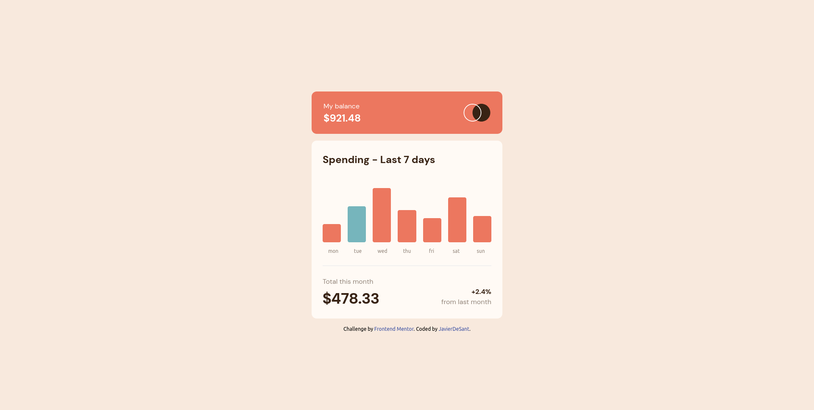
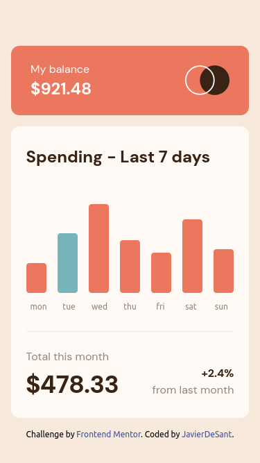
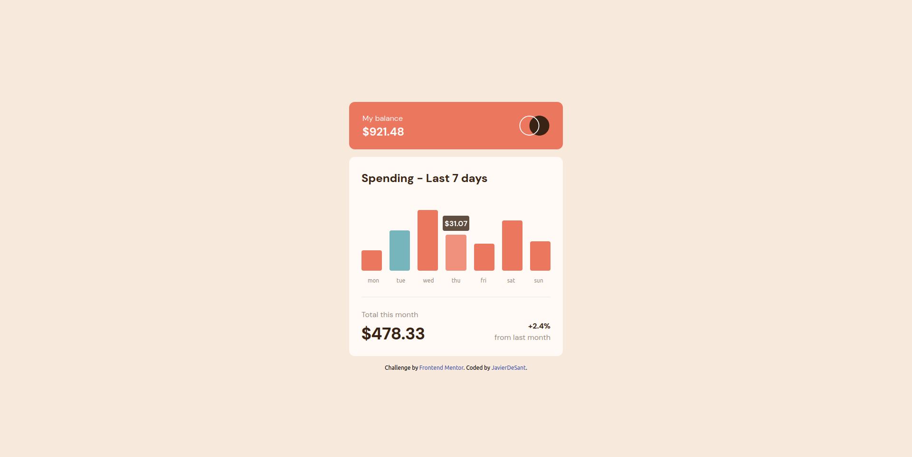

# Frontend Mentor - QR code component solution

This is a solution to the [QR code component challenge on Frontend Mentor](https://www.frontendmentor.io/challenges/qr-code-component-iux_sIO_H). Frontend Mentor challenges help you improve your coding skills by building realistic projects. 

## Table of contents

- [Overview](#overview)
  - [Screenshots](#screenshots)
  - [Links](#links)
  - [Built with](#built-with)
  - [What I learnt](#what-i-learnt)
- [Author](#author)

## Overview

### Screenshots

### Links

- Solution URL: [Responsive dynamic chart component using React and Tailwind CSS](https://www.frontendmentor.io/solutions/responsive-dynamic-chart-component-using-react-and-tailwind-css-2kVi6mP5qB)
- Live Site URL: (https://expenseschart-javierdesant.netlify.app/)

### Built with

- CSS custom properties
- Flexbox
- CSS Grid
- [React](https://reactjs.org/) - JS library
- [Vite](https://vitejs.dev/) - Build tool
- [Tailwind CSS](http://tailwindcss.com) - For styles

### What I learnt

In this project, I learned the following:

- Utilizing Tailwind CSS for styling
- Enhancing my TypeScript skills with React
- Implementing React functional components
- Creating custom hooks in React
- Designing for responsiveness
- Iterating over data using mapping
- Positioning elements on the page
- Adding transitions and animations
- Formatting currency display
- Deploying a React application
- Utilizing Flexbox and CSS Grid for layout

## Author

- Github - [JavierDeSant](https://github.com/javierdesant)
- Frontend Mentor - [@javierdesant](https://www.frontendmentor.io/profile/javierdesant)